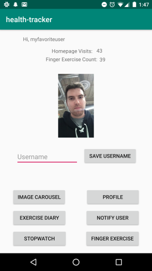

# Health-Tracker
## Lab 26: Android Fundamentals
* One key part of health is building finger strength and endurance. On the main page, display a number and a button. The number should increase when the button is clicked.
* Still on the main page, add a stopwatch. Have a button to [Start/Pause] and [Reset] the clock. The start/pause button should toggle between saying “start” and “pause.” And you should only be able to reset when the stopwatch is paused.
* At the top of our main page, we want to inspire our users with images of the type of person they can become. Display an image with a caption below it. (The caption should NOT be part of the image; it should be text.) Allow users to cycle through images and read the captions. Pressing next should go to the next image and its caption, pressing prev should go back. The app should display a (1/N), (2/N) … indicator so users know how many items are in the list

## Lab 27: Intents, Notifications and XML
* Move your Finger Exercises and Stopwatch into their own pages of your app. Add buttons on the homepage to link to those pages, and ensure that the user can use the back button on the device to return to the app homepage.
* Create a new activity for Notifications. Allow users to set up reminders to drink water, which should appear every 2 hours in the notification bar. (For testing, you might want to shorten this to 15 or 30 seconds.)

## Lab 28: Layouts, DBs and ListViews
* Set up a database to contain Exercise data. Each Exercise should have a title, quantity, and description, as well as a timestamp. For testing, add a single Exercise to the database.
* Add a new Activity to hold the Exercise Diary. In that view, display all entries from the Exercise database in a ListView. (At this point, that should show a single row.) Make sure that Exercise looks reasonable.
* At the top of the Exercise Diary activity, add a form that allows a user to enter data about an exercise. When they hit submit, the information about that exercise should be stored in the database and displayed in the ListView. You can choose how the timestamp works: either let the user enter when they completed the exercise, or use the time when they hit submit on the form.

Lab 29: Testing, Espresso and Permissions
* Add Espresso tests for all of the Activities we’ve built so far. In particular, the Finger Exercises would benefit from testing, as would the image carousel.
* Add the ability for users to enter a profile picture. Give them the option of taking a new photo with the camera, or using images already on their phone. Your app will need to request the appropriate permissions for this. Once users take a profile picture, you should display it on the homescreen.

Lab 33: Threading, Async, Web
* Add a replica of your Exercise model to the backend Spring app. Create a POST route that allows creating a new Exercise, and a GET route that responds with all Exercises currently in the database. Test these routes with Postman, deploy, and ensure there’s at least one Exercise in your deployed db.
* When a user opens the Exercise Diary page, the app should make a request to the server to retrieve all the Exercises in the server’s database. It should display both those Exercises and the ones that are local to the device within the Diary page.
* When a user creates a new Exercise locally on their device, in addition to saving it to the local database, the app should POST it to the server.

## Lab 34: Strings & Location
* Remove all hardcoded strings from your UI, and instead use the strings.xml file.
* When a user adds an exercise, they should be able to include their current location. Update your models appropriately, and display the location within the ListView.
* Ensure that the user’s username is correctly displayed throughout the app. Also, modify the homepage to include some key stats, such as the current finger exercise count and the total number of times the user has visited the homepage.

## Change Log
* 1/8/2019 - Added Lab 26 feature one (finger exerciser).
* 1/9/2019 - Added Lab 26 features two and three (stopwatch and image carousel).
* 1/10/2019 - Completed Lab 27:
  * Moved stopwatch and finger exercise to their own pages.
  * Added buttons to the homescreen so users access the new pages.
  * Created a button that will send a notification every 2 hours to the user reminding them to drink water (to test every 3 seconds uncomment line 57 and comment out line 58).
* 1/14/2019 to 1/16-2019 - Completed feature tasks for Lab 28:
  * Set up an Exercise database
  * Created a new Exercise Diary activity
  * Allow users to add new exercises to the database and view all exercises in the database
* 1/17/2019 - Wrote integration tests for Lab 28:
  * Adding an exercise
  * Retrieving exercises from the database
  * Any logic about turning an exercise into its String representation
* 1/18/2019 - Finished Lab 33 (adding and viewing exercise to Heroku Database) and the string.xml and location features for Lab 34
* 1/21/2019 - Finished the shared preferences feature for Lab 34
* 1/23/2019:
  * Users can take a picture or choose a picture from their files and upload them as their profile picture
  * Moved the image carousel to its own page
* 1/24/2019 - Wrote Espresso tests for the Finger Exercise, Stopwatch and Image Carousel pages

## Health-Tracker URL
http://health-tracker-backend.herokuapp.com/exercises
  * GET: returns json of exercises
  * POST: must include a title, quantity, description, latitude and longitude params

## Health-Tracker-Backend Repo
[Health-Tracker-Backend](https://github.com/evanslaton/health-tracker-backend)

## Libraries / Third Party Sources
* Stopwatch code by Amit Kumar Singh - https://www.c-sharpcorner.com/article/creating-stop-watch-android-application-tutorial/
* Recurring notification code by https://stackoverflow.com/questions/9406523/android-want-app-to-perform-tasks-every-second